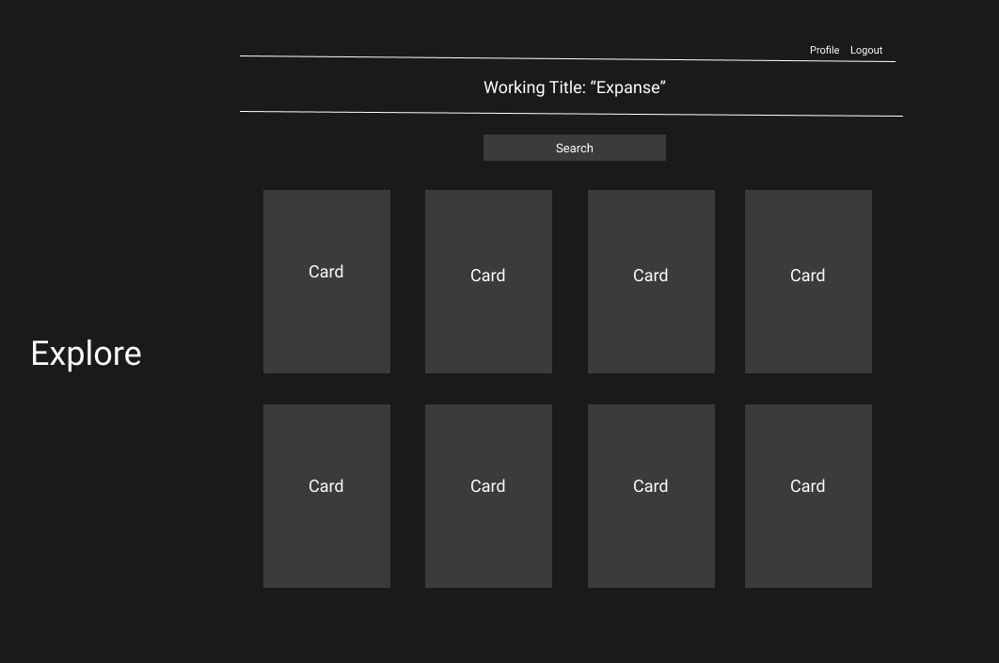
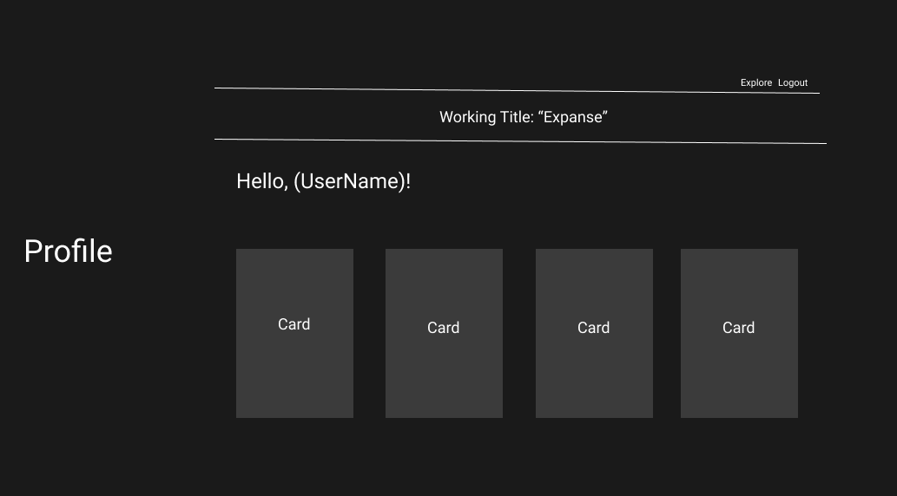
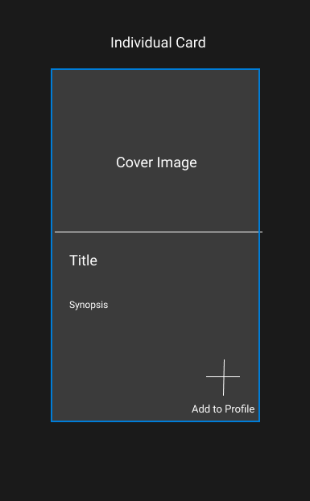

# Introduction

The world of anime is vast and in all honesty, a little intimidating to anyone that doesn't know where to look. Expanse is meant to be a tool to help traverse this weird medium in hopes of finding a genre or series suited to you. 

The app utilizes the Jikan (Unofficial MyAnimeList API) and provides the user a simple UI that is meant to be inviting but effective, removing information that might not be relevant to someone new to anime. 

# Requirements

(TBD)

# User Story

Use of the site is simple, create an account, use the search feature, save shows to your profile for later consumption. 

# Layout

